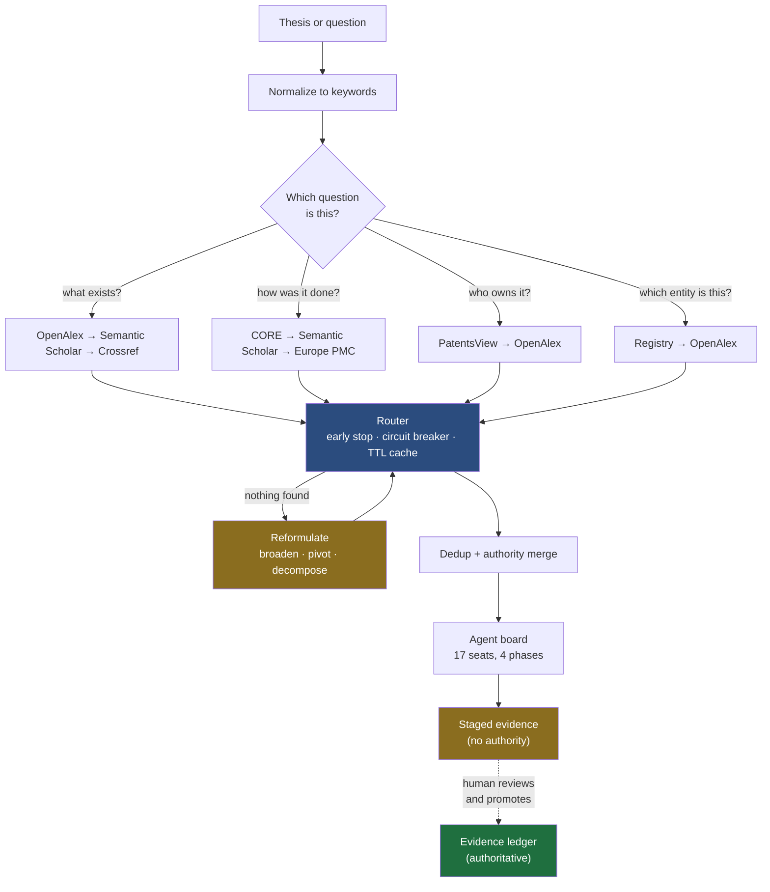

# evidence-pipeline

**A multi-agent pipeline for high-stakes investigation: literature review, prior-art search, due diligence, and regulatory exposure — across scholarly, patent, corporate, and legal sources.**

Before you commit capital or a year of work to a thesis, you need ground truth.

That sounds simple and isn't. The answer is scattered across journal articles, patent filings, regulatory dockets, corporate filings, and specialist registries that don't talk to each other, use different vocabulary for the same concept, and each demand a different kind of search. Worse, the failure is silent: a search that returns nothing looks exactly like a field that is empty.

This system answers the question systematically — surveying what already exists, surfacing the closest prior work, and flagging where a thesis is already crowded. Its output feeds the decisions that come *before* you spend: whether the idea is novel, whether the target is what it claims to be, whether the exposure is real.

---

## Quickstart

Runs with **no API keys and no network**. Offline mode uses a deterministic model stub and deterministic fake sources, so a fresh clone works immediately.

```bash
git clone https://github.com/JoeJeff101/evidence-pipeline.git
cd evidence-pipeline
pip install -e ".[dev]"

pytest                                              # 137 tests, fully offline
python -m evidence_pipeline.agents.run --offline    # 17-seat board, 4 phases
python -m evidence_pipeline.demo --offline "your question here"
```

Drop `--offline` to query real databases. The four keyless sources (OpenAlex, Europe PMC, Crossref, Semantic Scholar) need no credentials; key-gated connectors skip themselves and the chain falls through.

---

## Where this applies

The machinery is domain-neutral. What changes between uses is the roster of seats, the source chain, and which registry counts as authoritative.

| Domain | The question | Registry that settles it | Where it goes wrong |
|---|---|---|---|
| **Deep tech / R&D** | Has anyone already built this? Does the mechanism hold? | Patent numbers, DOIs | A prior-art search that finds nothing reads as a clear field, when it's usually a bad query |
| **Corporate due diligence** | Is the target what it claims? Who actually owns it? | SEC CIK, EDGAR accession | Management narrative gets cited as fact because nobody traced it to a filing |
| **Financial / market research** | Is the thesis supported or just consensus? | Filings, DOIs for the underlying research | Repetition across secondary sources gets mistaken for corroboration |
| **Legal / regulatory** | What rule applies, and who has been sanctioned under it? | CFR citations, court dockets | A summary of a rule is treated as the rule |
| **IP analysis** | How crowded is this space? Who is the closest assignee? | USPTO grants | Patent vocabulary rarely matches the researcher's, so precise queries return nothing |

One thread runs through the right-hand column: **the expensive failure is always a false negative dressed as a clean result.** Most of the engineering here exists to make that failure visible.

---

## What it actually does



**The question determines the source.** "Who has cited this?", "who owns this?", and "which registered entity is this?" are three different questions. Answering all three by throwing keywords at one index is how you confidently miss things.

**A dead end is retried differently, not repeated.** When every source returns nothing, the query is reformulated — broadened, pivoted to its most distinctive term, or decomposed into halves — before anything is reported as absent. The attempts are recorded, so "we found nothing" and "we found nothing after trying it four ways" are distinguishable claims.

**"Unavailable" is never conflated with "nothing found."** A source that times out raises; a source that answers with nothing returns empty. Collapsing those lets a timed-out patent database read as *no prior art exists*.

---

## The cognitive engine

This is not an API router with a language model bolted on. The retrieval layer is half the system; the other half is a board of seventeen seats, each with a distinct charter, temperature, and model tier, arranged so the crew's failure modes cancel rather than compound.

That arrangement exists because a language model left to itself has three reliable defects, and none of them are fixed by a better prompt alone:

| Defect | What it looks like | The structural answer |
|---|---|---|
| **Laziness** | Stops at the first plausible answer; pads thin retrieval with general knowledge | Charters require declared coverage, a named alternative explanation, and an explicit "the context is thin" when it is |
| **Sycophancy** | Agrees with whatever it was just shown; averages away disagreement | Seats are *chartered to attack* named upstream seats, with adversarial framing separate from ordinary context |
| **Hallucination** | Emits a well-formed identifier attached to a claim it does not support | Grade is computed from what resolves, not from what the model asserts; untraceable citations are quarantined by a sole writer |

The deliberate friction is the product. A high-temperature Domain Generalist is *supposed* to overreach — and a cold, skeptical Reproducibility Reviewer is chartered to check exactly that seat. A tournament judge does not pick a winner; it scores a fixed rubric, and the **code** computes the ranking, so the most confident-sounding champion cannot win on tone.

Full detail: **[docs/AGENT-PERSONAS.md](docs/AGENT-PERSONAS.md)**.

---

## The part I'd defend hardest

The obvious objection to any LLM research tool: **how do you know it didn't make this up?**

The model is never trusted with the authoritative record.

| | Staging | Promotion |
|---|---|---|
| Who | Agents | A human |
| Default | Writes on request | **Preview only** |
| Authority | None | Authoritative |
| Requires | Nothing | A resolvable primary-source identifier |

Agents may only *stage*. Promotion is a separate command a person runs: preview by default, writes only under `--apply`, filters to rows carrying a resolvable identifier, refuses duplicates, backs up first.

And the grade cannot be talked upwards. A claim naming a thing in an authoritative register — a patent number, a CIK, a docket, a CFR citation — is **REAL**. A claim backed only by a document that discusses it is **EST**. Neither is **WEAK**, and WEAK is not promotable at all. No amount of agent confidence moves a row up a grade; only a better identifier does.

Enforced in code rather than in a prompt, because *a prompt is a request and code is a constraint*. The asymmetry is deliberate: a fabricated number wearing a REAL tag is far worse than an honest gap. Gaps are visible and get filled. Fabrications propagate.

See **[docs/EVIDENCE-DISCIPLINE.md](docs/EVIDENCE-DISCIPLINE.md)**.

---

## Four orchestration topologies

The board is **configuration**; the orchestration is the product. Seats, phases, charters, tiers, and adversarial pairings live in [`boards/example_board.yaml`](boards/example_board.yaml) — nothing in the code knows what the board is investigating.

| Topology | Shape | Use when |
|---|---|---|
| [`sequential`](src/evidence_pipeline/agents/sequential.py) | Handoff with declared context and challenges | Order matters; each step builds on or attacks the last |
| [`tournament`](src/evidence_pipeline/agents/tournament.py) | Temperature-diverged fan-out → scored judge | Several approaches compete and one must be chosen defensibly |
| [`pipeline`](src/evidence_pipeline/agents/pipeline.py) | Thread-per-role, **sole writer** | Throughput matters and verification must not be routable-around |
| [`claims`](src/evidence_pipeline/agents/claims.py) | File-locked worker pool | Separate processes share a work list and must not duplicate |

See **[docs/ARCHITECTURE.md](docs/ARCHITECTURE.md)**.

---

## Sources

Nine connectors behind one signature; adding a tenth is one function and one registry entry. Full reference, access terms, documented limits, and worked pseudocode for wiring up enterprise sources like EDGAR or court archives: **[docs/SOURCES.md](docs/SOURCES.md)**.

Some databases that would improve coverage are deliberately **not** automated, because their terms don't permit it. Those run as a *human queue*: the pipeline emits the exact search strings, a person runs them, and results return through the same staging path with the same identifier requirements.

That's a design position, not an oversight. A pipeline that quietly scrapes a subscription database produces results its owner cannot publish, cannot cite in a filing, and cannot defend. The queue is slower and correct.

---

## Design notes

The hard part wasn't the AI. It was the workflow.

I mapped how this research gets done by hand, step by step, then worked out which steps an agent could own, which required a human decision, and where a wrong answer would be expensive. Each agent has a narrow job and hands off to the next, so every output traces back to a source and can be checked rather than taken on faith.

Most of what's in this repository is a consequence of that mapping rather than of anything model-specific — the rate governor, the variant cap, the circuit breaker, the reformulation ladder, the staging gate, the sole writer, the scored judge. Several exist because something went wrong first, and where that's true the code says so at the call site.

---

## Testing

```
137 passed in 0.37s
```

Every source adapter is replaced with a deterministic fake for every test, and the HTTP layer is patched to raise. Total replacement is deliberate: if only the expected adapters were faked, a routing bug would reach a live API and the test would still pass — slowly, while making unattributed network calls.

The suite covers intent precedence, fallback and breaker behaviour, the lean-budget case proving a healthy primary means the fallback is *never invoked*, dead-end reformulation, dedup and authority ranking, budget caps, cache hit/miss, identifier namespaces across five domains, the judge's scoring and tie-breaking, adversarial pairing validation, the staging grade rule and its cross-module contract with promotion, graceful degradation when the network raises, and all four agent topologies.

Execution is deterministic: the offline backend derives responses from a hash of its inputs, so the same board produces the same transcript every run.

---

## License

MIT — see [LICENSE](LICENSE).
