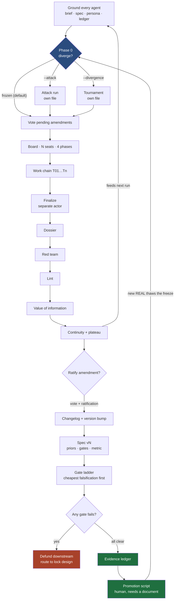

# run-engine

**A governed engine for high-stakes decisions: frozen by default, gated by cost of
falsification, and reporting a probability that only real evidence can move.**

Before you commit capital, or a year of work, or a patient to a protocol, you need to
know what you actually know. That sounds simple and isn't — not because the analysis is
hard, but because the failure mode is silent. A plan that has never been tested reads
exactly like a plan that has. A number nobody sourced looks exactly like a number
somebody did. And a language model asked to help will produce either one on request,
fluently.

This engine is a machine for keeping those apart. It runs a board of agents over a
question, stages what they find, refuses to promote anything without a resolvable
identifier, walks a gate ladder ordered by what each falsification costs, and reports a
probability alongside the fraction of that probability resting on promoted evidence
rather than on assumptions.

The subject matter is configuration. Two worked instantiations ship with it: a physical
product venture and a therapeutic repurposing candidate. They share no vocabulary and
run through identical code.

---

## Quickstart

**This system needs API keys to do its job.** The seats reason with a real model and pull
their facts from real databases; that is where the reasoning and the credibility both come
from. A run without keys is not a small version of the product, it is the harness with the
product taken out.

```bash
git clone https://github.com/JoeJeff101/run-engine.git
cd run-engine
pip install -e ".[dev]"
cp .env.example .env          # then fill it in — see "What you need" below

run-engine packs                                     # what is available to run
run-engine run --pack packs/manufacturing --live     # a real run: real model, real sources
run-engine sources --pack packs/manufacturing        # which connectors are live, and what is missing
run-engine run --pack packs/manufacturing --live --diverse   # attacks on a different vendor's model
```

There is also a keyless mode, and it is worth being exact about what it is for:

```bash
pytest                                      # 282 tests, hermetic — no keys, no network
run-engine run --pack packs/manufacturing   # --offline is the default: stub model, fake sources
```

Offline mode exists so a fresh clone installs and executes on the first try, and so the
orchestration can be tested without paying per iteration to watch nondeterministic output.
It proves the plumbing. **It does not produce research, and its transcript is not evidence
of anything** — the offline backend derives its text from a hash of its inputs, so the
board is not thinking, it is being simulated. Read an offline dossier as a shape, never as
a finding.

## What you need

Two different kinds of credential, and they fail in two different ways.

| | Without it | Set in |
|---|---|---|
| **A model key** (`ANTHROPIC_API_KEY`, plus the `MODEL_*` tier ids) | `--live` refuses to start and names the missing variable. There is no silent fallback to the stub, because a stub run filed as evidence is the worst outcome available. | `.env` |
| **Data-source keys** (`CORE_API_KEY`, `PATENTSVIEW_API_KEY`, `NCBI_API_KEY`, `S2_API_KEY`, …) | Each connector reports `needs key` and **skips**. It does not guess and it does not quietly downgrade to an estimate. Coverage narrows to the keyless sources and the gap is visible in `run-engine sources`. | `.env` |
| **`MODEL_OUTSIDE`** (a *different vendor's* model) | `--diverse` degrades: attacking seats keep their own tier, and `00_diversity.md` records that the attacks were not provider-independent. | `.env` |

`run-engine sources --pack <pack>` prints exactly which connectors are callable in your
environment and which are waiting on a variable, so the honest answer to "how much of this
board is actually informed?" is one command away. A missing credential is a visible gap in
coverage, and a gap you can see is worth more than a number you cannot trace.

A run writes an immutable archive and a self-contained HTML report:

```
runs/20260905T143542Z/
  00_grounding.md              brief + spec + contract + ledger, rebuilt this run
  00_diversity.md              whether the attacks were provider-independent
  T01…T17_*.md                 one note per task in the work chain
  95_value_of_information.md   what to fund next, and why that one
  96_promotion_candidates.md   rows waiting on a document
  97_redteam_verdict.md        adversarial review, plus the headline under a hostile reading
  98_lint_report.md            deterministic structural checks
  99_dossier.md                the compiled artifact this run is judged on
  _continuity.md               open items, and the plateau flag
  _prediction_log.jsonl        forecasts, written before the gates ran
  report.html                  the page you would actually send someone
  run.json
```

That archive is worth keeping only when the run behind it was live. The same folder
appears in offline mode and contains simulated text.

---

## What you get on run one

```
P(success) = 2.4% (80% CrI 0.1%–6.2%) · REAL fraction 0.00
```

with, printed directly beneath it:

> This estimate rests almost entirely on priors (REAL fraction 0.00). It is not a
> forecast — it is the board's stated assumptions, arithmetically combined. Treat it as
> a statement of what would have to be true, and fund the top-ranked experiment.

Both shipped packs have an **empty evidence ledger**, on purpose. Every gate reports
PENDING and the headline rests entirely on priors, because that is the truthful output
for a plan nobody has tested. Seeding the demo with invented REAL rows would have made
the screenshot better and inverted the entire point of the project.

Note what that number is and is not. It is the arithmetic working correctly on an empty
ledger, and it is identical whether the run was live or offline, because with nothing
promoted there is nothing for the board to have moved. **A live run with keys is what
starts filling the ledger** — the seats reason with a real model, reach real databases,
and stage findings a person can promote. Until then the headline is priors, and the engine
says so in words rather than dressing it up.

---

## The part I would defend hardest

The obvious objection to any LLM decision tool: **how do you know it didn't make this
up?**

The model is never trusted with the authoritative record.

| | Staging | Promotion |
|---|---|---|
| Who | Agents | A human |
| Default | Writes on request | **Preview only** |
| Authority | None | Authoritative |
| Requires | Nothing | A resolvable primary-source identifier |

The guarantee is not "agents never write the letters REAL" — a ledger is a text file and
nothing can stop them. The guarantee is that **saying REAL is not how a row becomes
REAL**. Promotion is a separate command a person runs, it previews by default, it refuses
any row whose citation does not match a known identifier namespace, and it **computes the
grade from that citation rather than reading the one the row claims for itself**.

That last clause used to be missing, and the gap was real: promotion checked that *some*
identifier was present and then trusted the grade written beside it, so a row asserting
REAL while citing a DOI went through as REAL. A DOI names a paper that makes a claim; a
registry identifier names the thing itself. Only the second earns REAL, and promotion now
enforces that mechanically:

| Row claims | Citation carries | Promoted as |
|---|---|---|
| REAL | a registry identifier | REAL |
| REAL | a citation identifier (DOI, PMID) | **EST**, and the downgrade is reported |
| REAL | no identifier | rejected |
| EST | a registry identifier | EST — promotion may lower a grade, never raise one |

Downgrade-only is deliberate. A promotion step that could *raise* a grade would be a new
path to REAL that nobody vetted, which is the exact thing the two-stage ledger exists to
prevent.

That rule then propagates into the arithmetic: only promoted rows update a gate's
posterior. Adding an EST row leaves the reported probability **bit-identical**, which is
a testable claim rather than a promise, and there is a test that asserts exactly it.

Enforced in code rather than in a prompt, because *a prompt is a request and code is a
constraint*. The asymmetry is deliberate: a fabricated number wearing a REAL tag is far
worse than an honest gap. Gaps are visible and get filled. Fabrications propagate.

---

## The eight invariants

Remove any one and this becomes an ordinary planning document with more steps. Each has
a test named after it, so they read as sentences in the test output.

1. **Frozen by default.** Exploration requires an explicit flag or new REAL evidence. The
   moment divergence becomes the default, you have a pivot machine.
2. **Only REAL rows move the number**, and exactly one script performs promotion, on
   presentation of a document.
3. **Gates ordered by cost of falsification.** Cheapest first — subject only to what each
   gate needs to exist before it can be run.
4. **Failure defunds downstream.** A red gate stops the spending the same day. This is
   the rule that saves the most money and is broken the most often.
5. **Generation and adjudication stay separate.** The seat that signs the dossier owns no
   other task in the chain.
6. **One master metric, with a do-no-harm clause.** A performance target without a
   survival constraint produces plans that win and kill the company.
7. **Two keys for a spec change.** A vote *and* an independent ratification, then a
   version bump with a diff. Never an edit.
8. **Re-ground every agent every run.** Brief, current spec, persona, ledger — reloaded.
   Continuity comes from artifacts, never from memory.

---

## Where the reasoning comes from

A board of agents is only worth building if its seats think better than one agent asked the
same question, and that does not happen by giving them different job titles.

**Seats are built from a historic figure, minus that figure's failure mode.** The method is
two-sided and the second side does the work: *borrow the trait that made the figure
productive, then attach the specific counter-rule for the failure that same trait causes.*
Edison is the worked example — the disposition you want in a seat facing an unexplored
problem, and a catalogue of how that disposition fails.

| Trait borrowed | The failure it causes | The counter-rule that cancels it |
|---|---|---|
| "Impossible" is merely untested | Overclaiming; announcing results before they exist | **Bold, not delusional.** Possibility fuels the work; evidence governs the claims. |
| A dead end is one logged way that won't work | Brute force — thousands of trials for one good question | **Momentum over deadlock.** Name the cheapest experiment that settles it. |
| 1% inspiration, 99% perspiration | Gatekeeping; hoarding credit | **Collaborate, don't gatekeep.** Hand forward a sharper problem than you received. |
| Total self-belief | Straying confidently outside competence | **Stay in your lane, at its edge.** Say plainly where your evidence ends. |

A seat given only the left column is a liability; given only the right, it is too cautious to
contribute. Delivered as a pair, it reaches — and the reach is bounded by a rule aimed
precisely at how that kind of reaching goes wrong.

**What a seat does when it does not know** is the whole anti-hallucination design, and it is
a branch with exactly three arms:

```
Fact needed, not in grounding, not in the ledger
    ├── 1. Go and find it       → retrieval; the finding is STAGED, never self-promoted
    ├── 2. Mark it and move on  → "the context is thin", carried as an open item
    └── 3. Fill the gap from memory
             ✗ not a discouraged option — an absent one
```

Arm 3 has nowhere to go. A number produced without a citation cannot be graded above EST,
and an EST row cannot move the probability: the row can be written, it simply does nothing.
Arms 1 and 2 are both successes — the judge rubric scores **zero for silence about gaps**,
so declining to state coverage is a failure rather than an omission.

**Seats declare a tier, not a model**, so a topology never names a vendor. Put the best model
where the reasoning is hard and a cheaper one everywhere else, and a seventeen-seat board
costs a fraction of the naive version with no measurable loss. Anyone wanting maximum depth
points every tier at the top model and pays for it; neither is a code change.

One tier is different. `outside` is chosen for **who trained it, not how capable it is**. Two
seats on the same model share a training distribution, so they share what it got wrong, and
an adversarial pairing between them checks style rather than substance. `--diverse` routes
seats chartered to attack onto a different vendor's model — not to make them smarter, but to
make their errors uncorrelated with their target's, which is the only property that matters
when a seat's job is to find what another seat missed.

**Credibility is a property of the source, not the finding.** If you found the fact you know
what it is worth; if an agent found it you do not. Every retrieved record is stamped by the
connector that produced it — `primary_db > indexed > oa > weak` — and the highest-authority
copy survives a merge while absorbing identifiers from the ones it displaces. The class is
declared once in the pack's `sources.yaml` and **the agent is never asked for it**, which is
why no amount of model confidence can move a row up a grade.

Full detail: **[docs/AGENT-COGNITION.md](docs/AGENT-COGNITION.md)**.

---

## How it works



Full specification, with the map from each part to the code that enforces it:
**[docs/RUN-ENGINE.md](docs/RUN-ENGINE.md)**.

---

## The probability

```
P(success) = P(G0) × P(G1|G0) × P(G2|G0,G1) × P(G3|…) × P(market | all gates)
```

A product, not an average, because the gates are conditional. Each term is a Beta
posterior: a prior argued in the boardroom and written into the spec, updated only by
promoted REAL rows.

Three figures are reported, never one — the mean, an 80% credible interval, and the
**REAL fraction**. The third is the one that matters. A plan at 62% with a REAL fraction
of 0.05 is not a 62% plan.

A fourth figure is computed adversarially. An outside reviewer is shown every promoted row
and asked one question — does the cited identifier actually establish the stated value? It
returns **identifiers only**; the engine demotes exactly those rows and runs the same
arithmetic again. The model names the rows and is never asked for the number, because a
probability produced by a model is an opinion wearing a decimal point. **The gap between
the two headlines is the part of the plan resting on evidence a hostile reader would not
grant.**

No SciPy: the incomplete beta function and its inverse are implemented in
[`probability.py`](src/run_engine/probability.py), because a decision engine that cannot
run without a numerical stack is one people will not run. The interval on the product is
obtained by exact moment-matching rather than sampling, so two runs of the same pack are
byte-identical — reproducibility is a property this thing sells, so it is tested rather
than asserted.

**Deterministic engine, advancing input.** Those two ideas sound contradictory and are
not, so it is worth stating plainly:

```
same brief + same spec + same ledger        →  byte-identical output   (auditable)
new evidence / continuity / amended spec    →  different output        (progress)
```

The engine is deterministic, which is what makes a transcript usable as evidence of
anything. The *input* is what advances: a promoted row, a ratified amendment, a
carried-forward open item. Progress never comes from sampling noise, and a run that
reproduces its predecessor exactly is reporting something true — that nothing has been
learned since — which is what the plateau flag is for.

**Value of information** decides what to fund next:

```
VoI per unit cost = ( Var(term) − E[Var(term | experiment)] ) × stake ÷ cost
```

which for a Beta-Binomial has an exact closed form. It is why the cheap demand test ranks
above the expensive pilot: it collapses roughly ten times more variance per unit spent.

Two orderings exist and they are computed separately, which an earlier version of this
page ran together. The **ladder** is ordered by each gate's declared cost of falsification,
subject to what each gate needs to exist before it can be run. **Value of information**
ranks the queued *experiments* by variance reduction per unit cost. They agree on the
comparison the test asserts — cheap demand test before expensive pilot — but the ladder
order is declared in the spec, not derived from the VoI arithmetic, and on the shipped
pack the top-ranked experiment is not the first gate.

---

## Two instantiations

Everything domain-specific is a directory of YAML. The engine contains none of it.

| | `packs/manufacturing` | `packs/therapeutic` |
|---|---|---|
| Question | Commit tooling capital to a countertop appliance? | Advance an approved drug into a second indication? |
| Substrate | Working capital: cash → inventory → committed sale → revenue | Patient exposure: untreated state → response → durable outcome |
| The irreversible step | The tooling PO | Opening enrolment |
| The key | Liquidation, tooling resale, contract exits | Stopping rules, rescue path, data monitoring committee |
| Crux | Does landed COGS at the minimum financeable quantity leave margin above CAC? | Is the retrospective signal real, or confounded by indication? |
| Registry of record | EDGAR, USITC, USPTO, CPSC | ClinicalTrials.gov, DailyMed, FAERS |
| Seats / tasks | 17 / 17 | 11 / 12 |

The chain length, the roster, the gates and the sources all differ. The governance, the
freeze, the ledger, the ladder and the arithmetic are the same code.

---

## Testing

```
282 passed in 1.37s
```

Every source adapter is replaced with a deterministic fake for every test, and the HTTP
layer is patched to raise. Total replacement is deliberate: if only the expected
adapters were faked, a routing bug would reach a live API and the test would still pass
— slowly, while making unattributed network calls. The live model backend is tested
against an injected fake client for the same reason.

Execution is deterministic: the offline backend derives responses from a hash of its
inputs, so the same pack produces the same transcript every run.

There is also a goal condition — `scripts/verify_goal.sh` — which checks the whole
system end to end, including a cold-clone install-and-run, and exits non-zero if any
criterion fails.

Its determinism criterion was itself wrong for a while, which is worth recording. The
check diffed two run folders while filtering dashed ISO dates, but run ids are compact
(`20260906T204857Z`) and appear in five artifacts — so it passed only when both runs
landed inside the same clock second, and reported the engine as nondeterministic whenever
they straddled one. It now normalises timestamps and ids to fixed tokens with `sed`, which
states exactly what is being forgiven and does not depend on which regex dialect the local
`diff` speaks. A reproducibility check that fails on a second boundary teaches you to
ignore it, and ignoring it is how real nondeterminism would get in.

---

## What this does not do

- **It does not make a model honest.** It makes a model's dishonesty visible and inert.
- **It does not produce a calibrated probability on run one.** It produces an auditable
  one. Calibration is a measurement you earn over several runs, and the prediction log
  exists so that it can be earned.
- **It does not decide anything.** Every gate result, every promotion, every ratification
  is an act by a person. The engine's contribution is that those acts are recorded, in
  order, with what was believed at the time.
- **It does not scrape sources whose terms forbid it.** Those run as a human queue: the
  engine emits the exact search strings, a person runs them, and the results return
  through the same staging path. Slower and correct.

### Known limits of the headline number

Documented here rather than discovered later, because a project whose argument is
"evidence, not assertion" should be first in line for it. These are properties of the
arithmetic as it stands, measured on the shipped manufacturing pack:

- **With an empty ledger, the headline is the bare product of the prior means.** 0.4 × 0.5
  × 0.5 × 0.6 × 0.4 = 0.0240, and the engine prints 2.4%. It is arithmetic on five numbers
  someone typed, which is why it ships with the caveat saying so in words.
- **It is sensitive to gate *count*.** Declaring a fifth gate at Beta(2,2) halves the
  headline; dropping one doubles it. Nothing about the world changed. A reviewer who
  declares six gates instead of four looks half as likely to succeed.
- **The REAL fraction has a low ceiling.** Total prior mass is 23 and running every gate
  once buys 4 observations, so the fraction tops out near 0.15 — meaning the top tier of
  the engine's own caveat text (≥ 0.35) is not reachable on either shipped pack.
- **The terms are combined as independent.** `P(G1|G0)` is notation; the code multiplies
  independent Beta means. Real gates are positively correlated, so the product is
  systematically pessimistic and the interval inherits it.

None of these affect the governance half — the freeze, the ledger, the ladder, the
defunding rule and the archive stand on their own. They are reasons to read the gate table
and the funding order as the operative outputs, and the single headline as the weakest
thing on the page.

---

## Design notes

The hard part wasn't the AI. It was the workflow.

I mapped how this kind of decision gets made by hand, step by step, then worked out
which steps an agent could own, which required a human decision, and where a wrong
answer would be expensive. Each agent has a narrow job and hands off to the next, so
every output traces back to a source and can be checked rather than taken on faith.

Most of what is in this repository is a consequence of that mapping rather than of
anything model-specific — the freeze, the two-key amendment, the cost-ordered ladder,
the defunding rule, the staging gate, the sole writer, the deterministic linter, the
prediction log. Several exist because something went wrong first, and where that is
true the code says so at the call site.

Three linter false positives were found by running the linter on the engine's own
output, and all three are fixed and commented. Holding our own writing to the rule we
impose on everyone else's seemed like the minimum.

---

## Documentation

| | |
|---|---|
| [docs/RUN-ENGINE.md](docs/RUN-ENGINE.md) | The full specification, mapped to the code that enforces it |
| [docs/ARCHITECTURE.md](docs/ARCHITECTURE.md) | Retrieval and orchestration layers in detail |
| [docs/EVIDENCE-DISCIPLINE.md](docs/EVIDENCE-DISCIPLINE.md) | Grades, identifier namespaces, and the promotion path |
| [docs/AGENT-COGNITION.md](docs/AGENT-COGNITION.md) | Where the reasoning comes from: persona construction, the unsure branch, model tiering, source credibility |
| [docs/AGENT-PERSONAS.md](docs/AGENT-PERSONAS.md) | Seat charters, operating rules, and adversarial pairings |
| [docs/SOURCES.md](docs/SOURCES.md) | Connectors, access terms, and how to add one |
| [docs/CLAIMS.md](docs/CLAIMS.md) | Every claim on this page, with the file or test that backs it |

---

## License

MIT — see [LICENSE](LICENSE).
