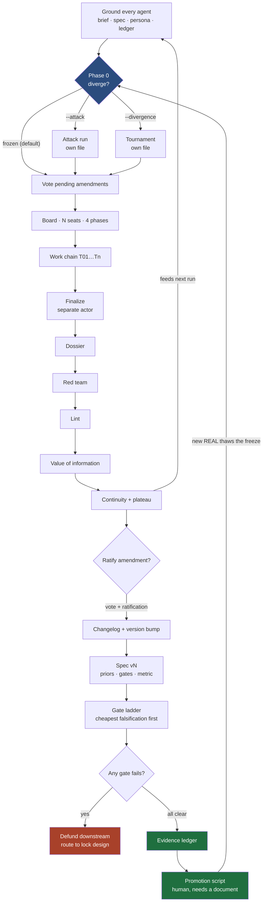

# run-engine

**A governed engine for high-stakes decisions: frozen by default, gated by cost of
falsification, and reporting a probability that only real evidence can move.**

Before you commit capital, or a year of work, or a patient to a protocol, you need to
know what you actually know. That sounds simple and isn't — not because the analysis is
hard, but because the failure mode is silent. A plan that has never been tested reads
exactly like a plan that has. A number nobody sourced looks exactly like a number
somebody did. And a language model asked to help will produce either one on request,
fluently.

This engine is a machine for keeping those apart. It runs a board of agents over a
question, stages what they find, refuses to promote anything without a resolvable
identifier, walks a gate ladder ordered by what each falsification costs, and reports a
probability alongside the fraction of that probability resting on promoted evidence
rather than on assumptions.

The subject matter is configuration. Two worked instantiations ship with it: a physical
product venture and a therapeutic repurposing candidate. They share no vocabulary and
run through identical code.

---

## Quickstart

Runs with **no API keys and no network**. Offline mode uses a deterministic model stub
and deterministic fake sources, so a fresh clone works immediately.

```bash
git clone https://github.com/JoeJeff101/run-engine.git
cd run-engine
pip install -e ".[dev]"

pytest                                              # 270 tests, fully offline
run-engine packs                                    # what is available to run
run-engine run --pack packs/manufacturing           # one governed run
run-engine sources --pack packs/manufacturing       # the data layer, and what it needs
```

A run writes an immutable archive and a self-contained HTML report:

```
runs/20260905T143542Z/
  00_grounding.md              brief + spec + contract + ledger, rebuilt this run
  T01…T17_*.md                 one note per task in the work chain
  95_value_of_information.md   what to fund next, and why that one
  96_promotion_candidates.md   rows waiting on a document
  97_redteam_verdict.md        adversarial review, before mechanical validation
  98_lint_report.md            deterministic structural checks
  99_dossier.md                the compiled artifact this run is judged on
  _continuity.md               open items, and the plateau flag
  _prediction_log.jsonl        forecasts, written before the gates ran
  report.html                  the page you would actually send someone
  run.json
```

Drop `--offline` for a live run against a real model; it needs `ANTHROPIC_API_KEY` and
says so precisely if it is missing.

---

## What you get on run one

```
P(success) = 2.4% (80% CrI 0.1%–6.2%) · REAL fraction 0.00
```

with, printed directly beneath it:

> This estimate rests almost entirely on priors (REAL fraction 0.00). It is not a
> forecast — it is the board's stated assumptions, arithmetically combined. Treat it as
> a statement of what would have to be true, and fund the top-ranked experiment.

Both shipped packs have an **empty evidence ledger**, on purpose. Every gate reports
PENDING and the headline rests entirely on priors, because that is the truthful output
for a plan nobody has tested. Seeding the demo with invented REAL rows would have made
the screenshot better and inverted the entire point of the project.

---

## The part I would defend hardest

The obvious objection to any LLM decision tool: **how do you know it didn't make this
up?**

The model is never trusted with the authoritative record.

| | Staging | Promotion |
|---|---|---|
| Who | Agents | A human |
| Default | Writes on request | **Preview only** |
| Authority | None | Authoritative |
| Requires | Nothing | A resolvable primary-source identifier |

The guarantee is not "agents never write the letters REAL" — a ledger is a text file and
nothing can stop them. The guarantee is that **saying REAL is not how a row becomes
REAL**. Promotion is a separate command a person runs, it previews by default, and it
refuses any row whose citation does not match a known identifier namespace.

That rule then propagates into the arithmetic: only promoted rows update a gate's
posterior. Adding an EST row leaves the reported probability **bit-identical**, which is
a testable claim rather than a promise, and there is a test that asserts exactly it.

Enforced in code rather than in a prompt, because *a prompt is a request and code is a
constraint*. The asymmetry is deliberate: a fabricated number wearing a REAL tag is far
worse than an honest gap. Gaps are visible and get filled. Fabrications propagate.

---

## The eight invariants

Remove any one and this becomes an ordinary planning document with more steps. Each has
a test named after it, so they read as sentences in the test output.

1. **Frozen by default.** Exploration requires an explicit flag or new REAL evidence. The
   moment divergence becomes the default, you have a pivot machine.
2. **Only REAL rows move the number**, and exactly one script performs promotion, on
   presentation of a document.
3. **Gates ordered by cost of falsification.** Cheapest first — subject only to what each
   gate needs to exist before it can be run.
4. **Failure defunds downstream.** A red gate stops the spending the same day. This is
   the rule that saves the most money and is broken the most often.
5. **Generation and adjudication stay separate.** The seat that signs the dossier owns no
   other task in the chain.
6. **One master metric, with a do-no-harm clause.** A performance target without a
   survival constraint produces plans that win and kill the company.
7. **Two keys for a spec change.** A vote *and* an independent ratification, then a
   version bump with a diff. Never an edit.
8. **Re-ground every agent every run.** Brief, current spec, persona, ledger — reloaded.
   Continuity comes from artifacts, never from memory.

---

## How it works



Full specification, with the map from each part to the code that enforces it:
**[docs/RUN-ENGINE.md](docs/RUN-ENGINE.md)**.

---

## The probability

```
P(success) = P(G0) × P(G1|G0) × P(G2|G0,G1) × P(G3|…) × P(market | all gates)
```

A product, not an average, because the gates are conditional. Each term is a Beta
posterior: a prior argued in the boardroom and written into the spec, updated only by
promoted REAL rows.

Three figures are reported, never one — the mean, an 80% credible interval, and the
**REAL fraction**. The third is the one that matters. A plan at 62% with a REAL fraction
of 0.05 is not a 62% plan.

No SciPy: the incomplete beta function and its inverse are implemented in
[`probability.py`](src/run_engine/probability.py), because a decision engine that cannot
run without a numerical stack is one people will not run. The interval on the product is
obtained by exact moment-matching rather than sampling, so two runs of the same pack are
byte-identical — reproducibility is a property this thing sells, so it is tested rather
than asserted.

**Value of information** decides what to fund next:

```
VoI per unit cost = ( Var(term) − E[Var(term | experiment)] ) × stake ÷ cost
```

which for a Beta-Binomial has an exact closed form. This is *why* the cheap demand test
runs before the expensive pilot — it collapses roughly ten times more variance per unit
spent. The ladder ordering falls out of the arithmetic instead of being imposed on it.

---

## Two instantiations

Everything domain-specific is a directory of YAML. The engine contains none of it.

| | `packs/manufacturing` | `packs/therapeutic` |
|---|---|---|
| Question | Commit tooling capital to a countertop appliance? | Advance an approved drug into a second indication? |
| Substrate | Working capital: cash → inventory → committed sale → revenue | Patient exposure: untreated state → response → durable outcome |
| The irreversible step | The tooling PO | Opening enrolment |
| The key | Liquidation, tooling resale, contract exits | Stopping rules, rescue path, data monitoring committee |
| Crux | Does landed COGS at the minimum financeable quantity leave margin above CAC? | Is the retrospective signal real, or confounded by indication? |
| Registry of record | EDGAR, USITC, USPTO, CPSC | ClinicalTrials.gov, DailyMed, FAERS |
| Seats / tasks | 17 / 17 | 11 / 12 |

The chain length, the roster, the gates and the sources all differ. The governance, the
freeze, the ledger, the ladder and the arithmetic are the same code.

---

## Testing

```
270 passed in 1.35s
```

Every source adapter is replaced with a deterministic fake for every test, and the HTTP
layer is patched to raise. Total replacement is deliberate: if only the expected
adapters were faked, a routing bug would reach a live API and the test would still pass
— slowly, while making unattributed network calls. The live model backend is tested
against an injected fake client for the same reason.

Execution is deterministic: the offline backend derives responses from a hash of its
inputs, so the same pack produces the same transcript every run.

There is also a goal condition — `scripts/verify_goal.sh` — which checks the whole
system end to end, including a cold-clone install-and-run, and exits non-zero if any
criterion fails.

---

## What this does not do

- **It does not make a model honest.** It makes a model's dishonesty visible and inert.
- **It does not produce a calibrated probability on run one.** It produces an auditable
  one. Calibration is a measurement you earn over several runs, and the prediction log
  exists so that it can be earned.
- **It does not decide anything.** Every gate result, every promotion, every ratification
  is an act by a person. The engine's contribution is that those acts are recorded, in
  order, with what was believed at the time.
- **It does not scrape sources whose terms forbid it.** Those run as a human queue: the
  engine emits the exact search strings, a person runs them, and the results return
  through the same staging path. Slower and correct.

---

## Design notes

The hard part wasn't the AI. It was the workflow.

I mapped how this kind of decision gets made by hand, step by step, then worked out
which steps an agent could own, which required a human decision, and where a wrong
answer would be expensive. Each agent has a narrow job and hands off to the next, so
every output traces back to a source and can be checked rather than taken on faith.

Most of what is in this repository is a consequence of that mapping rather than of
anything model-specific — the freeze, the two-key amendment, the cost-ordered ladder,
the defunding rule, the staging gate, the sole writer, the deterministic linter, the
prediction log. Several exist because something went wrong first, and where that is
true the code says so at the call site.

Three linter false positives were found by running the linter on the engine's own
output, and all three are fixed and commented. Holding our own writing to the rule we
impose on everyone else's seemed like the minimum.

---

## Documentation

| | |
|---|---|
| [docs/RUN-ENGINE.md](docs/RUN-ENGINE.md) | The full specification, mapped to the code that enforces it |
| [docs/ARCHITECTURE.md](docs/ARCHITECTURE.md) | Retrieval and orchestration layers in detail |
| [docs/EVIDENCE-DISCIPLINE.md](docs/EVIDENCE-DISCIPLINE.md) | Grades, identifier namespaces, and the promotion path |
| [docs/AGENT-COGNITION.md](docs/AGENT-COGNITION.md) | Where the reasoning comes from: persona construction, the unsure branch, model tiering, source credibility |
| [docs/AGENT-PERSONAS.md](docs/AGENT-PERSONAS.md) | Seat charters, operating rules, and adversarial pairings |
| [docs/SOURCES.md](docs/SOURCES.md) | Connectors, access terms, and how to add one |
| [docs/CLAIMS.md](docs/CLAIMS.md) | Every claim on this page, with the file or test that backs it |

---

## License

MIT — see [LICENSE](LICENSE).
