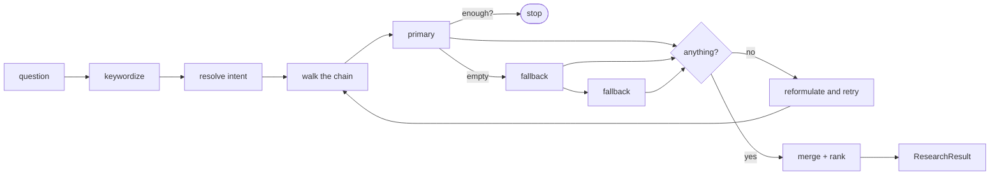
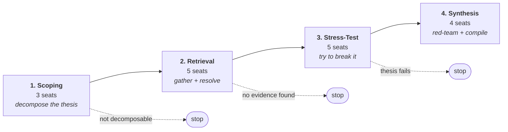
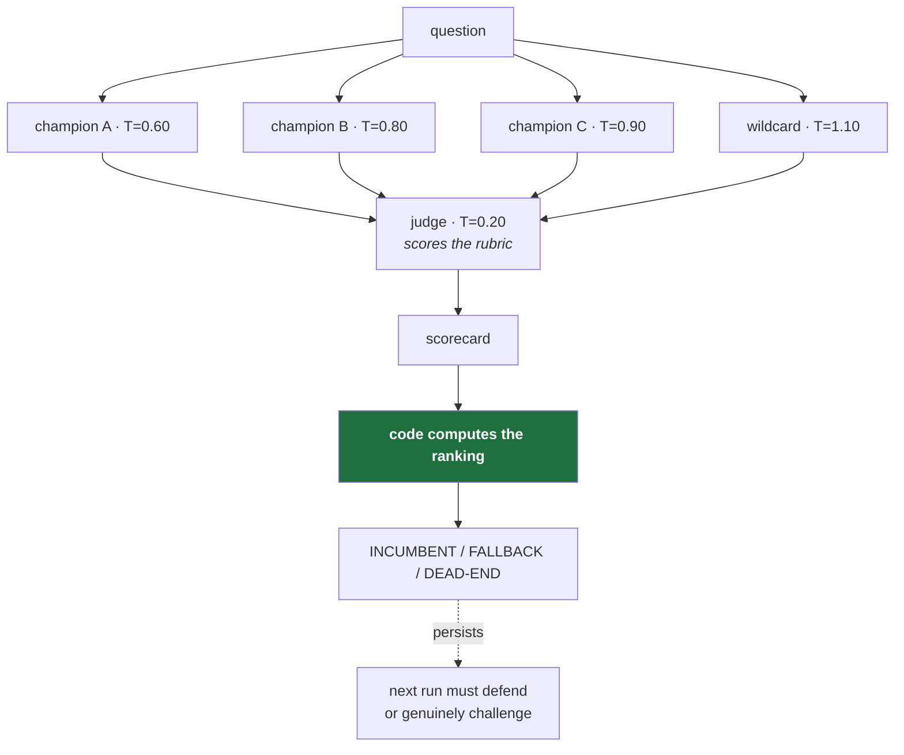
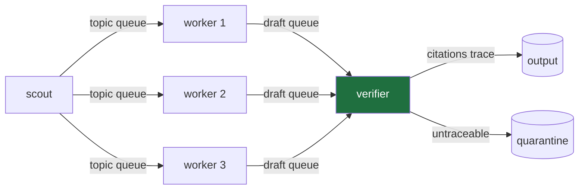

# Architecture

Two layers, usable independently. A **retrieval layer** that answers questions from sources, and an **orchestration layer** that runs a board of agents over the results. The router is useful with no agents; the topologies run with `router=None`.

---

## Retrieval layer

### Intent resolution

Precedence, most specific first: **explicit intent → scope → seat profile → default**. An unknown intent is filtered out and resolution falls through rather than raising — a typo in a seventeen-seat board should degrade to default behaviour, not abort at seat nine.

Seven intents ship, each with a ranked chain and a designated `primary_db`. See [`profiles.py`](../src/run_engine/retrieval/profiles.py): pure configuration, no I/O, so it reads as documentation and is asserted against directly in tests.

### The chain walk

Four behaviours, each a response to something that went wrong:

**Early stop.** Halts once `thin_hits` results are in hand *and* `min_sources` sources have been consulted. The second condition is not redundant — a breadth sweep whose first source is productive would otherwise collapse to a single-source query, which is what a breadth sweep exists to prevent. Tested by asserting the fallback adapter is never *called*, not merely that its records are absent.

**Circuit breaker.** Two consecutive exhausted-retry failures cut a source for the rest of the run. Permanent failures (400/410/422) are not retried at all — a malformed request fails identically on attempt two — but still count toward the breaker.

**Cache.** Keyed on `sha1(source | normalized_query | per_source | max_records)`, 14-day TTL, atomic writes. Because the key uses the normalized query, two differently-worded questions that reduce to the same keywords share an entry. A corrupt entry is a miss, never a crash.

**Never raise.** Total failure returns an empty `ResearchResult`. `SourceUnavailable` exists so "could not answer" stays distinguishable from "answered, and the answer is nothing."

### Dynamic search reformulation

The single most dangerous output this system can produce is *"no prior art found"* when the truth is *"the query was badly shaped."* Both look identical from the caller's side. So an empty result is never reported until it has been attacked from other angles.

When every source in every chain returns nothing, empty means one of three things, and they need different fixes:

| Diagnosis | Symptom | Transform | What it does |
|---|---|---|---|
| **Too narrow** | Conjunction of terms excludes everything | `broaden` | Keeps the highest-signal terms, drops qualifiers |
| **Wrong register** | The field calls it something else | `pivot_to_rare` | Queries the most distinctive terms alone, so the sources show you their vocabulary |
| **Compound** | Really two questions; no single document answers both | `decompose` | Splits into overlapping halves sharing a pivot term |

Signal is approximated by term length — in technical vocabulary the longer token is almost always the more discriminating one. A heuristic, but a stable one, and it costs nothing.

`decompose` produces *overlapping* halves, not disjoint ones. The shared pivot keeps both anchored to the same subject; two clean halves of a compound question frequently each have a literature even when their conjunction has none.

These are deterministic and run before any model is asked to think, because **most dead ends are structural rather than conceptual**. For the ones that aren't, `Router.search(reformulator=...)` accepts a callable — an agent that rethinks the taxonomy and proposes a genuine lateral pivot. Agent suggestions are tried *after* the cheap transforms, and a reformulator that raises cannot fail the search.

Two guarantees:

- **The failed query is never re-run.** Candidates are deduplicated against the original. Repeating a query that just returned nothing is precisely the behaviour this exists to prevent.
- **Attempts are surfaced, not hidden.** `ResearchResult.reformulations` records the strategy and query of every retry, so a seat reporting an empty field can show its work. The Prior Art Analyst's charter requires exactly that.

### Merge and rank

Records cluster by identity in descending trustworthiness: **DOI → PMID/registry id → normalized title**. A DOI must be syntactically valid (`10.` + 4–9 digits); a malformed one is not an identifier and falls through to title matching.

Within a cluster the survivor is chosen by authority (`primary_db > indexed > oa > weak`), then content richness, then citations. The survivor **absorbs missing fields** from records it displaces — the authoritative copy frequently lacks the open-access link the weaker copy carried.

### Budgets

`lean` / `standard` / `deep` bound `max_records`, `per_source`, `excerpt_chars`, `pack_chars`, `thin_hits`, `min_sources`. The most effective cost control in the system, because it bounds spend *before* any tokens are generated rather than truncating afterwards.

---

## The board: 17 seats, 4 phases

The seats are configuration. The phases encode a real constraint: **each one is a place where the work can be stopped before the next one costs anything.**

### Phase 1 — Problem scoping and thesis decomposition

*Lead Investigator · Mechanism Analyst · Domain Generalist*

Turn a vague thesis into checkable claims before spending anything. The Lead Investigator states what would have to be true, what evidence would settle it, **and what it would cost to be wrong**. The Mechanism Analyst enumerates candidate causal stories and ranks them by how much has to be true for each. The Domain Generalist runs at temperature 1.0 and is chartered to reach into adjacent fields.

The phase has an explicit abort: if the question cannot be decomposed into checkable claims, say so now rather than after fifteen seats have worked on it.

### Phase 2 — Evidence retrieval and entity resolution

*Methods Specialist · Modeling Specialist · Measurement Specialist · Prior Art Analyst · Standards Analyst*

Gather evidence and — critically — **resolve entities to identifiers**. This is the phase that determines whether anything downstream can be graded REAL. A claim about a company that never resolves to a CIK, or a rule that never resolves to a CFR citation, is capped at EST no matter how confident the analysis.

Each seat routes through its own profile: the Prior Art Analyst hits the patent chain, the Standards Analyst the registry chain. The Prior Art Analyst's charter contains the load-bearing instruction: *a prior-art search that finds nothing is far more often a bad search than a clear field* — so if it finds nothing, it must report what it searched and how it reformulated.

### Phase 3 — Stress-testing and feasibility

*Reproducibility Reviewer · Statistics Reviewer · External Validity Reviewer · Reliability Engineer · Process Engineer*

Try to break what Phase 2 produced. This is where the adversarial pairings concentrate: three of the four `challenges` edges on the example board live here. The Reproducibility Reviewer separates independently corroborated findings from single-source ones — and is told that corroboration between two sources sharing an origin is not independent corroboration.

This is also where the **tournament** runs when several approaches compete.

### Phase 4 — Synthesis, red-teaming and dossier compilation

*Systems Engineer · Integration Engineer · Cost Analyst · Dossier Editor*

Convert survivors into requirements, attack them once more, and compile. The Integration Engineer challenges the Systems Engineer directly — the seat that writes requirements should not be the last word on whether they survive contact with what already exists.

The Dossier Editor carries the strongest prohibition on the board: **forbidden from resolving a disagreement between seats by picking a side or splitting the difference.** Two competent reviewers reaching different conclusions is information; averaging destroys it. Identifiers pass through unchanged, and a claim that arrived without one reaches the reader without one.

---

## The judge and the tournament

### Why a tournament at all

Ask one agent "which approach is best?" and you get one answer that sounds equally confident whether or not it considered the alternatives. The fix is to make the alternatives argue.

### The temperature spread is the mechanism

Run N champions at identical temperature and you get N paraphrases of one answer — the appearance of deliberation with none of the substance. Spread the temperature and low-temp champions produce careful conventional arguments while high-temp ones produce genuinely different proposals, some of which are bad.

**Bad proposals are load-bearing.** They give the judge something to reject, which is how you can tell whether it is discriminating or rubber-stamping. A judge that scores everything above the floor is broken, and without deliberately weak entries you cannot see that.

### The judge does not pick a winner

This is the central design decision. A judge asked *"which is best?"* rewards the most confident-sounding champion, because confidence is the most salient signal in the text. A judge asked *"how many load-bearing claims carry a resolvable identifier?"* has to go and count.

So the judge **scores a fixed rubric**, and the **code computes the ranking**.

| Criterion | Weight | What it asks |
|---|---|---|
| `evidence_density` | **3** | What fraction of load-bearing claims carry a resolvable identifier? Count them. |
| `specificity` | 2 | Concrete mechanisms, quantities, parties, conditions — or gestures at categories? |
| `falsifiability` | 2 | What observation would prove it wrong? Unfalsifiable scores 0 regardless of plausibility. |
| `coverage_honesty` | 1 | Does it declare what it could not find? **Silence about gaps scores 0, not 3.** |

Maximum 40 points. Weights are lopsided toward evidence density on purpose: an argument that is elegant, specific, falsifiable, and uncited should lose to a plodding one with citations, because the first is a hypothesis and the second is a finding.

### Penalties: what gets punished

| Penalty | Points | Trigger |
|---|---|---|
| `uncited_specific` | **−4** | A specific number, name, or date presented without an identifier |
| `logical_leap` | **−3** | A conclusion that does not follow from the evidence cited for it |
| `confidence_substitution` | −2 | Assertive language standing in for evidence — *"clearly"*, *"well established"*, *"widely accepted"* |
| `unfalsifiable_claim` | −2 | A claim constructed so no observation could contradict it |

`uncited_specific` is the heaviest because a specific unsourced number is the most convincing thing a model can emit and the hardest to catch downstream — it has the *shape* of rigour.

### How ranking is computed

Ranking is by **total → evidence density → fewest penalties**.

Evidence density breaks ties deliberately: when two options score identically overall, the one whose claims are actually citable wins. The test suite pins this with an exact tie (`evidence_density=4` at weight 3 versus `specificity=5` + `coverage_honesty=2`, both totalling 12) and asserts the citable option is ranked first.

Three guards, all enforced in code and none of them delegated to the judge's discretion:

- **Marks are clamped to 0–5.** A judge that writes `99` does not get to outvote the rubric.
- **Unknown criteria and penalties are ignored.** An invented criterion carries no weight.
- **A uniformly weak field yields no incumbent.** Everything below the dead-end floor (35% of maximum) is DEAD-END, including the top scorer. Promoting the least-bad option would launder a weak field into a decision.

Malformed rows are dropped rather than guessed at. If the whole scorecard is unreadable the run falls back to a plain status ledger, and **records that it did** — a judge that cannot follow the rubric is itself a signal worth surfacing.

### The standing ledger

Verdicts persist across runs. A later run inherits the standing decision and must either defend it with new evidence or mount a real challenge. Without persistence, successive runs rediscover and re-litigate the same dead ends forever, which is expensive and feels like progress.

What persists is **status and prose note only, never the marks**. Carrying numbers forward would anchor the next judge on a previous judge's scoring instead of the proposals actually in front of it — and those marks described last run's proposals, not this run's.

### Adversarial verification

`red_team()` runs after the tournament: several independent reviewers, each told to **refute**, not evaluate. Asking "is this correct?" reliably yields agreement — agreement is the path of least resistance for a model shown a confident assertion. Survival requires a majority of failed refutations; **ties go against the claim.**

---

## The other three topologies

### Sequential handoff

Each seat receives, verbatim, the output of the upstream seats it *named* in `context`, plus adversarially-framed material from seats it named in `challenges`. Nothing is implicit.

Why not let every agent see everything? Shared-everything context grows quadratically, so a seventeen-seat board becomes unaffordable around seat nine. Worse, it destroys the value of distinct seats: once every agent has read every other agent's reasoning they converge, and seventeen correlated opinions are worth roughly one.

Board validation is strict at load time — mistyped dependency, forward reference, duplicate key, unknown tier, challenging a seat that hasn't spoken yet — all refuse to start. Every one of those would otherwise surface as **silence**: a seat with an empty context still produces confident, ungrounded output, and nothing errors.

### Thread-per-role with a sole writer

Only the verifier writes. Two consequences: write races are structurally impossible rather than "handled", and **verification cannot be skipped** by a sufficiently confident agent. Every identifier a draft cites must appear among the records that draft actually retrieved; anything else was invented, however plausible, and is quarantined.

Queues are bounded, so a slow verifier applies backpressure rather than accumulating unverified drafts.

### File-locked claim ledger

For crews running as **separate OS processes**, where in-process locks are useless. Claims taken under `fcntl.flock`, writes via temp-file plus atomic `os.replace`. Stale reclamation exists because processes die; a claim held by a killed process would otherwise block that topic forever.

> The timestamp handling is worth reading. Storing `f"{t:.0f}"` rounds to *nearest*, so a claim taken at `t=100.7` records `101` — half a second in the future. Elapsed time computes negative, and a claim whose age is negative can never become stale. Fixed with an exactly round-trippable timestamp and `>=` comparison. This surfaced as a test that failed 3 times in 20 runs.

---

## Cost control

1. **Budget presets** — bound retrieval before tokens are generated.
2. **Model tiering** — seats declare a tier; the example board is 5 heavy / 12 light. All seventeen on a frontier model costs seventeen times what it needs to, and most seats do work a cheaper model does indistinguishably well.
3. **Hard call caps** — a real ceiling, not a warning. Past the cap calls refuse and the board ends cleanly with partial results.
4. **Cache** — an iterative session re-queries constantly.

A cost estimate prints at the end of every run, which makes spend a visible design constraint rather than a monthly surprise.

---

## Determinism

The offline backend derives every response from a hash of its inputs, so the same board produces the same transcript every run, and all 137 tests execute with no network and no credentials.

This is not only a convenience. Orchestration bugs — a seat that never receives its upstream context, a judge that silently sees nothing, a worker pool that double-claims — are structural, and they reproduce perfectly against a deterministic stub. Debugging them against a live model means paying per iteration to watch nondeterministic output, which is slower *and* worse.
