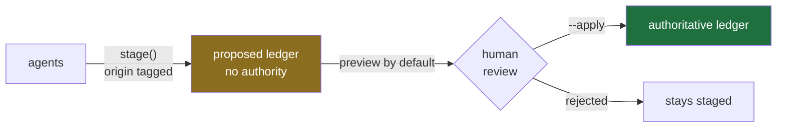
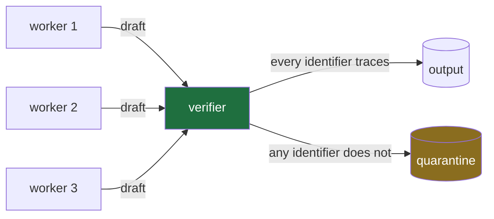

# Evidence discipline

The obvious objection to any LLM research tool: **how do you know it didn't make this up?**

The answer here is structural, not rhetorical. The model is never trusted with the authoritative record.

---

## Two stages



| | Staging | Promotion |
|---|---|---|
| Who | Agents | A human |
| Default | Writes on request (`dry=True`) | **Preview only** |
| Bounded | ≤4 rows per call | — |
| Idempotent | Yes, on (topic, claim, value) | Yes, refuses duplicates |
| Requires | Nothing | A resolvable primary-source identifier |
| Backup | n/a | Timestamped, before any write |
| Authority | **None** | Authoritative |

No agent is given a tool that calls `promote()`. There is no path from staging to the authoritative ledger that does not pass through a person — asserted directly in the test suite.

---

## Two kinds of identifier

This is the seam that generalizes the pipeline past science. Every high-stakes domain has an authoritative register; only the pattern changes.

**REGISTRY** identifiers name a thing in an authoritative register. A CIK *is* the company. A patent number *is* the grant. A docket number *is* the case. Someone else resolves it and gets the same object.

**CITATION** identifiers name a document that discusses a thing. A DOI is a real identifier for a paper — but the paper's claim is still a claim.

| Namespace | Domain | Kind | Example |
|---|---|---|---|
| PubChem CID | scientific | registry | `PUBCHEM:2244` |
| US patent | intellectual property | registry | `USPTO:10000000` |
| SEC CIK | corporate | registry | `CIK: 0000320193` |
| EDGAR accession | corporate filings | registry | `0000320193-24-000123` |
| CFR citation | regulatory | registry | `17 CFR 240.10b-5` |
| Court docket | legal | registry | `No. 1:21-cv-01234` |
| DOI | scholarly | citation | `10.1126/science.1236098` |
| PMID | biomedical | citation | `PMID: 23887888` |
| OpenAlex | scholarly | citation | `https://openalex.org/W2119459576` |

The table lives in [`ledger.py::IDENTIFIER_NAMESPACES`](../src/run_engine/evidence/ledger.py) with each pattern and a worked example. A test asserts **every example matches its own pattern**, which guards the table against a regex that drifts from its documentation.

Adding a domain is one tuple entry.

---

## The grading rule

| Grade | Backed by | Promotable |
|---|---|---|
| **REAL** | A registry identifier — the thing itself resolves | yes |
| **EST** | A citation identifier — a document about the thing resolves | yes |
| **WEAK** | Neither | **no** |

**The grade cannot be talked upwards.** `grade_for()` reads the record's identifiers and nothing else. There is no field a model fills in to claim REAL. No amount of agent confidence moves a row up a grade; only a better identifier does.

Both halves are checked *independently*. A row can be graded REAL and still be rejected at promotion if its citation cell contains no resolvable identifier — so an agent that mislabels a grade gains nothing.

The practical consequence for a diligence file: a claim about a company that never resolved to a CIK is capped at EST no matter how confident the analysis reads. Entity resolution isn't bookkeeping. It's what determines whether a finding can carry weight.

---

## How the judge's rating interacts with the grade

Two scoring systems that never touch each other's job.

| | Ledger grade | Judge score |
|---|---|---|
| Scores | A single claim | A whole argument |
| Computed from | Identifiers only, mechanically | A rubric, marked by a model |
| Question | *Can this be independently resolved?* | *Is this argument well-supported?* |
| Can a model influence it? | **No** | Yes, within clamps |
| Output | REAL / EST / WEAK | 0–40, then a code-computed status |

They meet at one point: the judge's heaviest criterion, `evidence_density` at weight 3, asks **what fraction of load-bearing claims carry a resolvable identifier** — which is precisely the fraction that could survive promotion. The rubric rewards arguments built from promotable claims.

That coupling has a deliberate direction. **The judge's score never affects a grade.** A tournament-winning argument confers no authority on its claims; each still stands or falls on its own identifier. An argument can score 38/40 and contain nothing promotable, and the ledger will be unmoved.

The reverse coupling — grades informing scores — is the useful one. An argument whose claims are all REAL will score high on evidence density because that is what the criterion measures.

Related enforcement in the judge, all in code:

- **Marks clamp to 0–5.** A judge writing `99` does not outvote the rubric.
- **`uncited_specific` costs −4** — the heaviest penalty, because a specific unsourced number is the most convincing thing a model emits and the hardest to catch downstream. It has the *shape* of rigour.
- **`coverage_honesty` scores 0 for silence**, not a neutral 3. Not declaring gaps is a failure, not an omission.
- **A uniformly weak field yields no incumbent.** Promoting the least-bad option would launder a weak field into a decision.

---

## The sole writer and quarantine

A universal safeguard, and the one that survives contact with an agent that has decided it knows better.



Exactly one thread writes. Two consequences, and the second matters more:

**Write races are structurally impossible.** Not "handled" — there is one writer, so the class of bug does not exist. Concurrency bugs in a system whose output is a knowledge base are nasty precisely because they don't crash; they produce a file that is subtly wrong and looks fine.

**Verification cannot be routed around.** If workers could write, verification becomes a step a sufficiently confident agent skips. Making the verifier the only path to disk turns *"please check your work"* from a request into a property of the topology.

The check itself: **every identifier appearing in a draft must also appear among the records that draft actually retrieved.** An identifier in the text that isn't in the retrieval set was invented, however plausible it looks. The draft is quarantined — kept for inspection, never promoted to output.

This catches the most convincing failure mode there is: a well-formed identifier, correctly formatted, attached to a claim it does not support. Every format check passes. Only provenance catches it.

A test asserts writes come from exactly one thread, by name.

---

## Provenance

Every staged row carries:

| Column | Purpose |
|---|---|
| `id` | `PROP-<run>-<nn>`, stable |
| `topic` / `claim` / `value` | what is being asserted |
| `grade` | REAL / EST / WEAK |
| `source` | the citation — must satisfy the promotion regex |
| `origin` | which channel produced it (`board:prior_art_analyst`, `demo`, a human queue return) |
| `run` | which run |
| `staged_at` | UTC timestamp |

`origin` matters more than it looks. When a claim turns out to be wrong, the first question is *which part of the system produced it*. Without that column the answer is unrecoverable.

Content is escaped so a pipe in a claim cannot break the table, and the authoritative file is backed up before any write — always, not on failure. By the time you know you needed a backup it is too late to take one.

---

## Promoting

```bash
run-engine promote staged.md authoritative.md            # preview
run-engine promote staged.md authoritative.md --apply    # write
```

Preview prints what would be promoted and, for everything rejected, *why*. **The rejections are the useful output** — they show where the run produced plausible text with nothing resolvable behind it.
